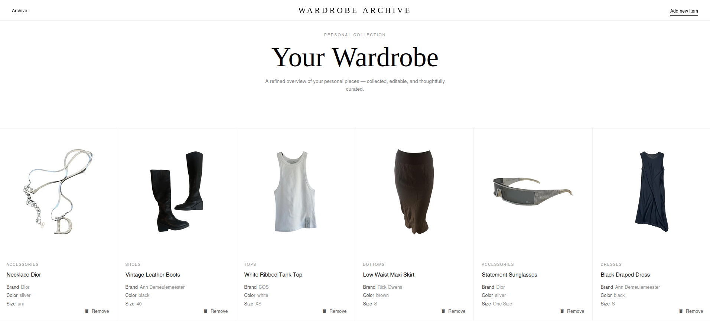
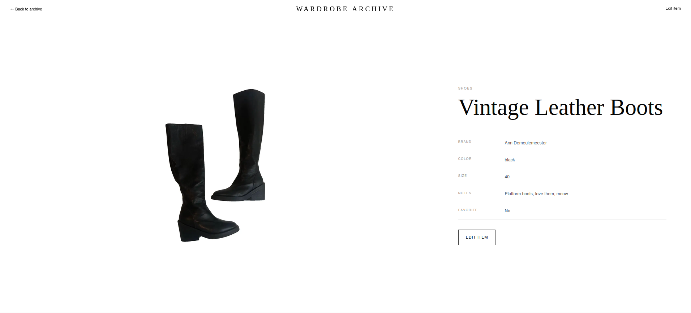
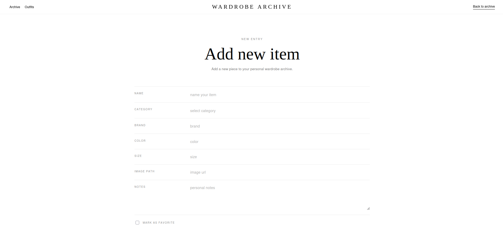
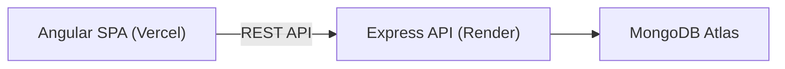

# Wardrobe Archive

> A minimalist full-stack application for collecting, organizing, and curating a
> personal wardrobe.

[](https://github.com/sophmophxx/webtech_project/actions/workflows/backend-ci.yml)
[](https://github.com/sophmophxx/webtech_project/actions/workflows/frontend-ci.yml)


Wardrobe Archive is a responsive CRUD application for managing a digital clothing
collection. It combines an Angular single-page application with a REST API built
with Node.js and Express. Clothing items are stored in MongoDB and can be viewed,
created, edited, and deleted through the user interface.

This repository was created as a university Web Technologies project.

## Features

- Browse all saved clothing items in a responsive archive
- View individual item details
- Add new pieces with category, brand, color, size, image, notes, and favorite status
- Edit or delete existing pieces
- Client-side reactive form validation
- Server-side request validation with structured error responses
- Loading, empty, and error states in the user interface
- Seed script with sample wardrobe data
- Automated frontend and backend quality checks with GitHub Actions

## Screenshots

### Wardrobe overview



### Item detail



### Create item



## Tech stack

| Area         | Technologies                                              |
| ------------ | --------------------------------------------------------- |
| Frontend     | Angular 22, TypeScript, Angular Material, RxJS, SCSS      |
| Backend      | Node.js 22, Express 5, Mongoose, Zod                      |
| Database     | MongoDB / MongoDB Atlas                                   |
| Testing      | Vitest, Angular TestBed, Supertest, mongodb-memory-server |
| Code quality | ESLint, Prettier, npm audit                               |
| Deployment   | Vercel (frontend), Render (backend)                       |
| CI           | GitHub Actions                                            |

## Architecture



The frontend communicates with the backend through the versioned
`/api/v1/items` endpoints. The backend validates incoming data before reading from
or writing to MongoDB.

## Live demo

- Frontend: https://webtech-project-one.vercel.app
- Backend health check: https://wardrobe-backend-ojyw.onrender.com/api/v1/health

## Deployment

The frontend is deployed on Vercel and the backend is deployed as a Render Web
Service. MongoDB Atlas is used as the hosted database.

Both Vercel and Render are connected to the GitHub repository and automatically
deploy changes from the `main` branch.

## Project structure

```text
webtech_project/
|-- .github/
|   `-- workflows/
|-- backend/
|   |-- scripts/
|   |-- src/
|   |   |-- config/
|   |   |-- controllers/
|   |   |-- middleware/
|   |   |-- models/
|   |   |-- routes/
|   |   |-- utils/
|   |   `-- validators/
|   `-- tests/
|-- frontend/
|   |-- public/
|   `-- src/
|       `-- app/
|           |-- core/
|           |-- features/
|           `-- shared/
|-- package.json
`-- README.md
```

## Getting started

### Prerequisites

- [Node.js 22](https://nodejs.org/)
- npm
- A local MongoDB instance or a
  [MongoDB Atlas](https://www.mongodb.com/atlas) connection string

### 1. Clone the repository

```bash
git clone https://github.com/sophmophxx/webtech_project.git
cd webtech_project
```

### 2. Install dependencies

The frontend, backend, and repository root have separate dependency files:

```bash
npm ci
npm ci --prefix backend
npm ci --prefix frontend
```

### 3. Configure the backend

Create a `backend/.env` file:

```env
PORT=3000
MONGO_URI=mongodb+srv://<username>:<password>@<cluster>/<database>
CLIENT_URL=http://localhost:4200
NODE_ENV=development
```

`MONGO_URI` is required. Multiple allowed frontend origins can be supplied as a
comma-separated `CLIENT_URL` value.

Do not commit the `.env` file or expose database credentials in the repository.

### 4. Start the application

Run both applications from the repository root:

```bash
npm run dev
```

The services are then available at:

- Frontend: [http://localhost:4200](http://localhost:4200)
- Backend: [http://localhost:3000](http://localhost:3000)
- Health check: [http://localhost:3000/api/v1/health](http://localhost:3000/api/v1/health)

The applications can also be started separately with `npm run dev:frontend` and
`npm run dev:backend`.

## Sample data

Add the included sample wardrobe items to the configured development database:

```bash
npm run seed --prefix backend
```

To delete all existing clothing items before inserting the samples:

```bash
npm run seed:reset --prefix backend
```

> [!CAUTION]
> `seed:reset` deletes every clothing item in the configured database. Seeding is
> disabled when `NODE_ENV=production`.

## API reference

Base URL: `http://localhost:3000/api/v1`

| Method   | Endpoint     | Description                             |
| -------- | ------------ | --------------------------------------- |
| `GET`    | `/health`    | Return API health information           |
| `GET`    | `/items`     | Return all clothing items, newest first |
| `GET`    | `/items/:id` | Return one clothing item                |
| `POST`   | `/items`     | Create a clothing item                  |
| `PATCH`  | `/items/:id` | Partially update a clothing item        |
| `DELETE` | `/items/:id` | Delete a clothing item                  |

### Example request body

```json
{
  "name": "Black Draped Dress",
  "category": "dresses",
  "brand": "Ann Demeulemeester",
  "color": "black",
  "size": "S",
  "imageUrl": "https://example.com/black-dress.jpg",
  "notes": "Clean silhouette, evening piece",
  "favorite": true
}
```

`name` and `category` are required. Supported categories are `tops`, `bottoms`,
`dresses`, `outerwear`, `shoes`, `bags`, `accessories`, and `other`.

## Tests and quality checks

Run all frontend and backend tests from the repository root:

```bash
npm test
```

Run the complete validation pipeline:

```bash
npm run validate
```

The validation scripts cover formatting, linting, automated tests, security
auditing, and the frontend production build. Backend integration tests use an
in-memory MongoDB instance, so they do not modify the configured development
database.

Additional useful commands:

| Command                                  | Description                        |
| ---------------------------------------- | ---------------------------------- |
| `npm run test:coverage --prefix backend` | Run backend tests with coverage    |
| `npm run test:watch --prefix backend`    | Run backend tests in watch mode    |
| `npm run test:ci --prefix frontend`      | Run frontend tests once            |
| `npm run build --prefix frontend`        | Create a production frontend build |
| `npm run fix --prefix backend`           | Format and lint-fix backend files  |
| `npm run fix --prefix frontend`          | Format and lint-fix frontend files |

## Security

The backend includes:

- HTTP security headers with Helmet
- A configurable CORS allowlist
- Rate limiting of 100 requests per 15 minutes
- A 10 KB JSON request-body limit
- Zod and Mongoose validation
- Centralized error and unknown-route handling
- Environment-based configuration for secrets

## Author

Created by [sophmophxx](https://github.com/sophmophxx).
