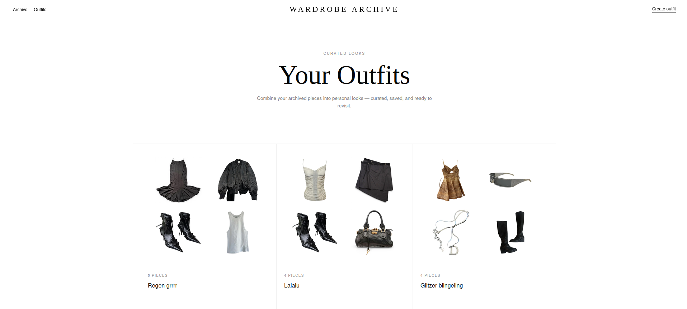
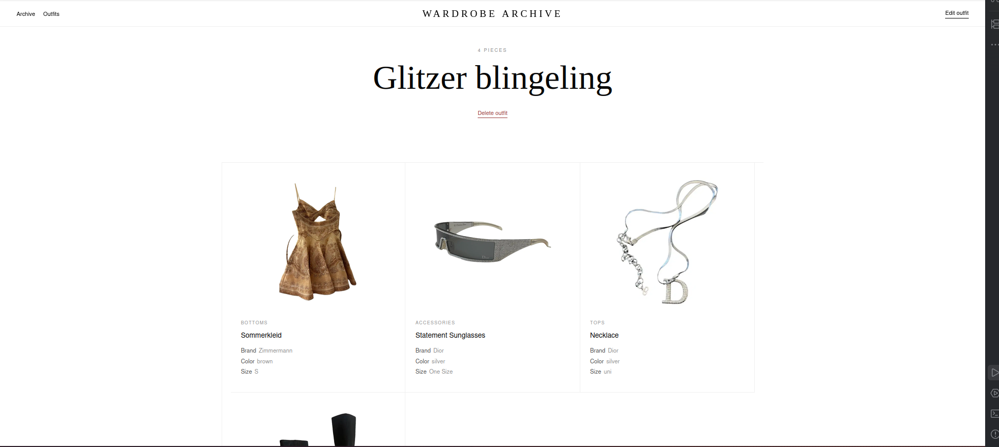
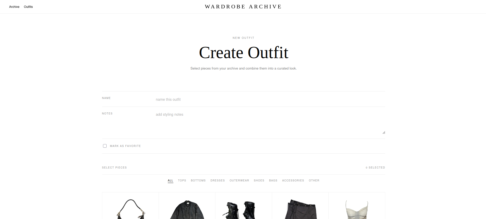
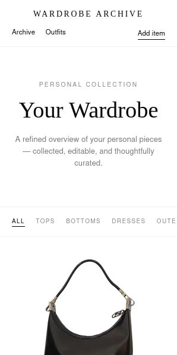
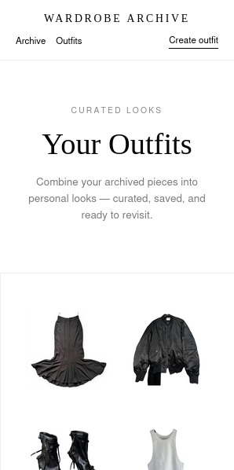
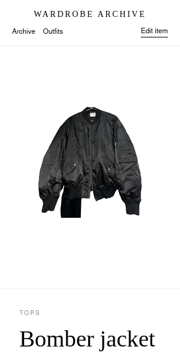
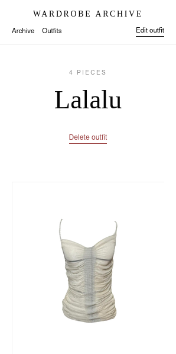
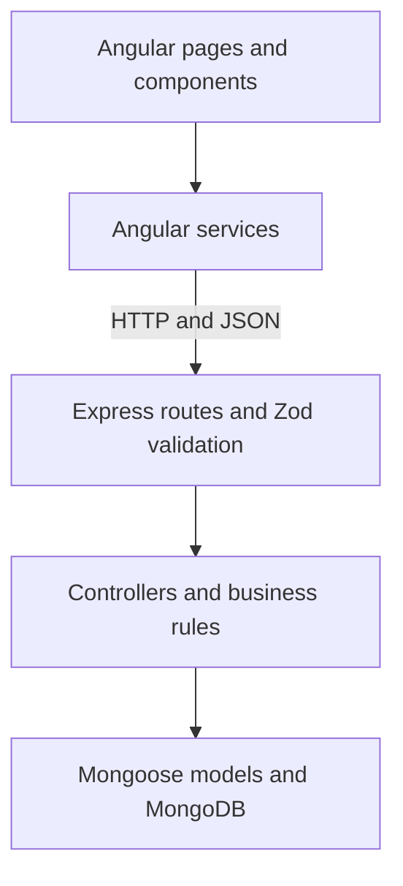

# Wardrobe Archive

> A minimalist full-stack web application for collecting, organizing, and curating a personal
> wardrobe and combining individual pieces into saved outfits.

[](https://github.com/sophmophxx/webtech_project/actions/workflows/backend-ci.yml)
[](https://github.com/sophmophxx/webtech_project/actions/workflows/frontend-ci.yml)


Wardrobe Archive is a responsive CRUD application developed as a university Web Technologies
project. The application consists of an Angular single-page application, a REST API built with
Node.js and Express, and a MongoDB database accessed through Mongoose.

Users can maintain a digital archive of clothing items and combine those items into reusable
outfits. Both resources support complete create, read, update, and delete workflows. The visual
design follows a reduced editorial style and adapts to desktop and mobile screen sizes. Reusable
category filters help users navigate the wardrobe and the item selection used by the outfit
editor.

## Table of contents

- [Live demo](#live-demo)
- [Features](#features)
- [Screenshots](#screenshots)
- [Technology stack](#technology-stack)
- [Architecture](#architecture)
- [Data model](#data-model)
- [Frontend routes](#frontend-routes)
- [API reference](#api-reference)
- [Project structure](#project-structure)
- [Local installation](#local-installation)
- [Sample data](#sample-data)
- [Tests and quality checks](#tests-and-quality-checks)
- [Security](#security)
- [Deployment](#deployment)
- [Current limitations](#current-limitations)
- [Use of AI tools](#use-of-ai-tools)
- [Author](#author)

## Live demo

- **Frontend:** [https://webtech-project-one.vercel.app](https://webtech-project-one.vercel.app)
- **Backend health check:**
  [https://wardrobe-backend-ojyw.onrender.com/api/v1/health](https://wardrobe-backend-ojyw.onrender.com/api/v1/health)

The hosted backend may need a short moment to respond after a period of inactivity because the
Render service can enter an idle state.

## Features

### Wardrobe

- Display all saved clothing items in a responsive archive
- Filter the archive by `all`, `tops`, `bottoms`, `dresses`, `outerwear`, `shoes`, `bags`,
  `accessories`, or `other`
- Display a dedicated empty state when the selected category contains no items
- Open a dedicated detail page for every item
- Add new clothing items through a reusable reactive form
- Edit existing items with prefilled form values
- Cancel an edit and return to the corresponding item detail page without saving changes
- Delete an item only after an explicit confirmation
- Store category, brand, color, size, image path, notes, and favorite status
- Use either an absolute HTTP/HTTPS image URL or a frontend-relative image path
- Navigate through item cards with mouse, keyboard, Enter, or Space
- Display loading, empty, and error states

### Outfits

- Display all saved outfits with previews of up to four selected pieces
- Create an outfit by selecting existing wardrobe items
- Filter the available pieces by category while creating or editing an outfit
- Preserve the current item selection when switching between filter categories
- Require at least one unique clothing item per outfit
- Edit outfit information and its selected pieces
- Open every referenced item from the outfit detail page
- Return from an item detail page to the originating outfit
- Delete an outfit only after an explicit confirmation
- Store outfit notes and favorite status

### Data consistency

- Outfit documents reference existing clothing items through MongoDB `ObjectId` values
- Referenced items are populated before outfits are returned to the frontend
- The backend rejects missing, invalid, or duplicate item references
- Deleting a clothing item removes its reference from all outfits
- Outfits without any remaining pieces are deleted automatically
- The reset seed command removes outfits before replacing the wardrobe items

### User experience and design

- Responsive SCSS layouts for desktop and mobile devices
- Reusable category filter with active states, keyboard focus styles, and ARIA attributes
- Horizontally scrollable category navigation on narrow screens
- Consistently sized selection cards for calm and predictable outfit-editor layouts
- Angular Material components for icons, cards, buttons, and loading indicators
- Custom Wardrobe Archive favicon
- Dedicated frontend 404 page for unknown routes
- SPA fallback support for directly opened frontend routes
- Consistent navigation between the archive, outfits, detail pages, and forms

### Backend and project quality

- Versioned REST endpoints under `/api/v1`
- Zod request validation and Mongoose schema validation
- Centralized asynchronous and error handling
- Seed script with local sample images
- Automated frontend and backend test suites
- Separate GitHub Actions workflows for both applications
- Formatting, linting, production build, coverage, and security-audit checks

## Screenshots

The screenshots in this section show the main application workflows. They can be replaced with
updated images in `docs/screenshots/` without changing the surrounding documentation.

### Wardrobe overview


### Clothing item detail


### Create clothing item


### Outfits overview



### Outfit detail



### Create outfit



### Mobile view

<p align="center">
  
  
  
  
</p>

## Technology stack

| Area                   | Technologies                                                    |
| ---------------------- | --------------------------------------------------------------- |
| Frontend               | Angular 22, TypeScript, Angular Router, Reactive Forms, Signals |
| UI and styling         | Angular Material, Angular CDK, SCSS                             |
| Reactive programming   | RxJS                                                            |
| Backend                | Node.js 22, Express 5                                           |
| Database               | MongoDB / MongoDB Atlas, Mongoose 9                             |
| Validation             | Angular Validators, Zod 4, Mongoose schema validation           |
| Frontend testing       | Vitest, Angular TestBed, jsdom                                  |
| Backend testing        | Vitest, Supertest, mongodb-memory-server                        |
| Code quality           | ESLint, Prettier, npm audit, Angular build budgets              |
| Continuous integration | GitHub Actions                                                  |
| Deployment             | Vercel, Render, MongoDB Atlas                                   |

## Architecture

The project is organized as a monorepo. Frontend and backend are separate applications with their
own dependencies, scripts, tests, and CI pipelines.



### Frontend responsibilities

- **Pages** represent complete routes such as the wardrobe overview, item details, or outfit
  editor.
- **Components** contain reusable interface elements, including the clothing item card and item
  form.
- **Services** encapsulate all HTTP communication and return typed RxJS observables.
- **Models** describe the TypeScript structures received from and sent to the API.
- **Signals** store local page state such as data, the selected category, loading flags, error
  messages, and delete confirmations.
- **Computed signals** derive filtered item collections without changing the data received from
  the API.
- **Environment files** select the local or deployed API base URL during the Angular build.

### Backend responsibilities

- **Routes** map HTTP methods and paths to validation middleware and controller functions.
- **Validators** define the accepted request bodies with Zod.
- **Controllers** implement CRUD operations and cross-resource rules.
- **Models** define MongoDB document structures and database-level validation with Mongoose.
- **Middleware** centralizes request validation, unknown-route handling, and error responses.
- **Configuration modules** load environment variables and establish the MongoDB connection.

### Typical request flow

1. A page calls a method on `ClothingItemService` or `OutfitService`.
2. Angular `HttpClient` sends a request to the configured `/api/v1` endpoint.
3. Express matches the request to a route.
4. POST and PATCH bodies are validated by Zod before reaching the controller.
5. The controller applies business rules and calls a Mongoose model.
6. Mongoose reads or changes the MongoDB documents.
7. The API returns JSON and the Angular page updates its signals.

### Category filter flow

Category filtering is implemented entirely in the frontend and does not trigger additional API
requests:

1. `ClothingItemService` loads the complete item collection once.
2. Each page stores the active filter in a `selectedCategory` signal.
3. A `filteredItems` computed signal returns either all items or only matching items.
4. The reusable `CategoryFilter` component receives the active value through an input and emits
   category changes through an output.
5. Outfit selections are stored separately in a `Set<string>`, so changing the visible category
   does not remove already selected pieces.

The `CLOTHING_ITEM_CATEGORIES` readonly tuple is the shared source for the TypeScript category
type, the clothing item form options, and the filter buttons. This prevents the supported
categories from being duplicated across components.

## Data model

### Clothing item

| Field       | Type               | Required  | Rules                                    |
| ----------- | ------------------ | --------- | ---------------------------------------- |
| `_id`       | MongoDB `ObjectId` | Generated | Unique database identifier               |
| `name`      | `string`           | Yes       | Trimmed, maximum 100 characters          |
| `category`  | `string`           | Yes       | Must be one of the supported categories  |
| `brand`     | `string`           | No        | Trimmed, maximum 100 characters          |
| `color`     | `string`           | No        | Trimmed, maximum 50 characters           |
| `size`      | `string`           | No        | Trimmed, maximum 20 characters           |
| `imageUrl`  | `string`           | No        | Relative path or absolute HTTP/HTTPS URL |
| `notes`     | `string`           | No        | Trimmed, maximum 500 characters          |
| `favorite`  | `boolean`          | No        | Defaults to `false`                      |
| `createdAt` | ISO timestamp      | Generated | Added by Mongoose                        |
| `updatedAt` | ISO timestamp      | Generated | Updated by Mongoose                      |

Supported categories:

```text
tops, bottoms, dresses, outerwear, shoes, bags, accessories, other
```

### Outfit

| Field       | Type               | Required  | Rules                                      |
| ----------- | ------------------ | --------- | ------------------------------------------ |
| `_id`       | MongoDB `ObjectId` | Generated | Unique database identifier                 |
| `name`      | `string`           | Yes       | Trimmed, maximum 100 characters            |
| `notes`     | `string`           | No        | Trimmed, maximum 500 characters            |
| `items`     | `ObjectId[]`       | Yes       | At least one unique existing clothing item |
| `favorite`  | `boolean`          | No        | Defaults to `false`                        |
| `createdAt` | ISO timestamp      | Generated | Added by Mongoose                          |
| `updatedAt` | ISO timestamp      | Generated | Updated by Mongoose                        |

An outfit stores references instead of copies of clothing items. The API uses Mongoose `populate`
so that the frontend receives complete clothing item objects in the `items` array.

## Frontend routes

| Route               | Page                     | Purpose                           |
| ------------------- | ------------------------ | --------------------------------- |
| `/`                 | `WardrobePage`           | Display all clothing items        |
| `/items/new`        | `ClothingItemCreatePage` | Create a clothing item            |
| `/items/:id`        | `ClothingItemDetailPage` | Display one clothing item         |
| `/items/:id/edit`   | `ClothingItemEditPage`   | Edit a clothing item              |
| `/outfits`          | `OutfitsPage`            | Display all outfits               |
| `/outfits/new`      | `OutfitCreatePage`       | Create an outfit                  |
| `/outfits/:id`      | `OutfitDetailPage`       | Display one outfit and its pieces |
| `/outfits/:id/edit` | `OutfitEditPage`         | Edit an outfit                    |
| `**`                | `NotFoundPage`           | Handle every unknown frontend URL |

The wildcard route is deliberately declared last so that it cannot intercept valid routes.

## API reference

### Base URLs

Local development:

```text
http://localhost:3000/api/v1
```

Deployed API:

```text
https://wardrobe-backend-ojyw.onrender.com/api/v1
```

### Health endpoint

| Method | Endpoint  | Description                                       |
| ------ | --------- | ------------------------------------------------- |
| `GET`  | `/health` | Return status, environment, uptime, and timestamp |

### Clothing item endpoints

| Method   | Endpoint     | Success status | Description                                |
| -------- | ------------ | -------------- | ------------------------------------------ |
| `GET`    | `/items`     | `200`          | Return all items, newest first             |
| `GET`    | `/items/:id` | `200`          | Return one item                            |
| `POST`   | `/items`     | `201`          | Create an item                             |
| `PATCH`  | `/items/:id` | `200`          | Partially update an item                   |
| `DELETE` | `/items/:id` | `200`          | Delete an item and clean outfit references |

Example item request body:

```json
{
  "name": "Black Draped Dress",
  "category": "dresses",
  "brand": "Ann Demeulemeester",
  "color": "black",
  "size": "S",
  "imageUrl": "https://example.com/black-dress.jpg",
  "notes": "Clean silhouette, evening piece",
  "favorite": true
}
```

Only `name` and `category` are required when creating an item. PATCH requests accept any non-empty
subset of the fields.

### Outfit endpoints

| Method   | Endpoint       | Success status | Description                                           |
| -------- | -------------- | -------------- | ----------------------------------------------------- |
| `GET`    | `/outfits`     | `200`          | Return all outfits with populated items, newest first |
| `GET`    | `/outfits/:id` | `200`          | Return one outfit with populated items                |
| `POST`   | `/outfits`     | `201`          | Create an outfit from existing item IDs               |
| `PATCH`  | `/outfits/:id` | `200`          | Partially update an outfit                            |
| `DELETE` | `/outfits/:id` | `200`          | Delete an outfit                                      |

Example outfit request body:

```json
{
  "name": "Monochrome Evening",
  "notes": "Minimal look for an evening event",
  "items": ["66a111111111111111111111", "66a222222222222222222222"],
  "favorite": true
}
```

Every value in `items` must be a valid ID of an existing clothing item. Duplicate IDs and empty
item arrays are rejected.

### Error responses

The API uses consistent JSON error responses. Depending on the request, it returns:

- `400 Bad Request` for invalid IDs, request bodies, or missing item references
- `404 Not Found` for unknown API routes or resources that do not exist
- `409 Conflict` for supported database conflict errors
- `500 Internal Server Error` for unexpected failures

Example validation response:

```json
{
  "message": "Ungültige Eingabedaten",
  "errors": {
    "name": ["Invalid input"]
  }
}
```

Unexpected production errors do not expose stack traces or internal implementation details.

## Project structure

```text
webtech_project/
|-- .github/
|   `-- workflows/
|       |-- backend-ci.yml
|       `-- frontend-ci.yml
|-- backend/
|   |-- scripts/
|   |   `-- seedClothingItems.js
|   |-- src/
|   |   |-- config/          # Environment and database configuration
|   |   |-- controllers/     # CRUD operations and business rules
|   |   |-- middleware/      # Validation and error handling
|   |   |-- models/          # Mongoose schemas
|   |   |-- routes/          # Express route definitions
|   |   |-- utils/           # AppError and asyncHandler
|   |   |-- validators/      # Zod request schemas
|   |   |-- app.js           # Express application setup
|   |   `-- server.js        # Database connection and HTTP startup
|   |-- tests/               # Backend integration and middleware tests
|   |-- .env.example
|   `-- package.json
|-- docs/
|   `-- screenshots/
|-- frontend/
|   |-- public/
|   |   |-- images/seed/     # Images referenced by the seed data
|   |   `-- favicon-wa.svg
|   |-- src/
|   |   |-- app/
|   |   |   |-- core/
|   |   |   |   |-- constants/   # API endpoint constants
|   |   |   |   `-- services/    # HTTP services
|   |   |   |-- features/
|   |   |   |   `-- wardrobe/
|   |   |   |       |-- components/
|   |   |   |       |   |-- category-filter/
|   |   |   |       |   |-- clothing-item-card/
|   |   |   |       |   `-- clothing-item-form/
|   |   |   |       `-- pages/        # Wardrobe, item, and outfit route pages
|   |   |   |-- shared/
|   |   |   |   |-- models/      # TypeScript interfaces
|   |   |   |   `-- pages/       # Shared 404 page
|   |   |   |-- app.config.ts
|   |   |   `-- app.routes.ts
|   |   |-- environments/        # Development and production API URLs
|   |   |-- index.html
|   |   `-- styles.scss
|   |-- angular.json
|   `-- package.json
|-- package.json                  # Monorepo convenience scripts
`-- README.md
```

## Local installation

### Prerequisites

- [Node.js](https://nodejs.org/) 22.22.3 or newer within the Node 22 release line
- npm
- A local MongoDB server or a [MongoDB Atlas](https://www.mongodb.com/atlas) cluster
- Git

Node 22 is also used by the GitHub Actions workflows and the deployed backend configuration.

### 1. Clone the repository

```bash
git clone https://github.com/sophmophxx/webtech_project.git
cd webtech_project
```

### 2. Install dependencies

The repository root, backend, and frontend have separate dependency files:

```bash
npm ci
npm ci --prefix backend
npm ci --prefix frontend
```

The root installation provides `concurrently`, which starts both applications with one command.

### 3. Configure the backend

Copy the example environment file:

```bash
cp backend/.env.example backend/.env
```

Then configure `backend/.env`:

```env
PORT=3000
MONGO_URI=mongodb+srv://<username>:<password>@<cluster>/<database>
CLIENT_URL=http://localhost:4200
NODE_ENV=development
```

| Variable     | Required | Default                 | Purpose                                        |
| ------------ | -------- | ----------------------- | ---------------------------------------------- |
| `MONGO_URI`  | Yes      | None                    | MongoDB connection string                      |
| `PORT`       | No       | `3000`                  | Backend HTTP port                              |
| `CLIENT_URL` | No       | `http://localhost:4200` | Allowed CORS origin or comma-separated origins |
| `NODE_ENV`   | No       | `development`           | Runtime environment                            |

For multiple allowed frontend origins, separate the values with commas:

```env
CLIENT_URL=http://localhost:4200,https://example.vercel.app
```

Do not commit `backend/.env` or any database credentials.

When MongoDB Atlas is used, the current development IP address must also be allowed in the Atlas
network access settings.

### 4. Start both applications

From the repository root:

```bash
npm run dev
```

Available local URLs:

- Frontend: [http://localhost:4200](http://localhost:4200)
- Backend root: [http://localhost:3000](http://localhost:3000)
- API health check:
  [http://localhost:3000/api/v1/health](http://localhost:3000/api/v1/health)

The applications can also be started separately:

```bash
npm run dev:backend
npm run dev:frontend
```

## Sample data

The seed script inserts seven example clothing items. Their images are stored in
`frontend/public/images/seed/` and are referenced with relative paths.

Insert the sample items into the configured development database:

```bash
npm run seed --prefix backend
```

This command adds another set of sample items without deleting existing data.

Reset the wardrobe and insert a clean sample dataset:

```bash
npm run seed:reset --prefix backend
```

The reset process performs the following actions:

1. Delete all outfits.
2. Delete all clothing items.
3. Insert the seven sample clothing items.

> [!CAUTION]
> `seed:reset` permanently deletes all outfit and clothing item documents in the configured
> database. The seed script refuses to run when `NODE_ENV=production`.

## Tests and quality checks

### Complete repository checks

Run all backend and frontend tests:

```bash
npm test
```

Run the complete validation pipelines:

```bash
npm run validate
```

The validation command runs backend validation first and frontend validation afterwards.

### Available commands

| Command                                  | Description                            |
| ---------------------------------------- | -------------------------------------- |
| `npm test`                               | Run backend and frontend tests once    |
| `npm run validate`                       | Run all configured quality gates       |
| `npm run test:coverage --prefix backend` | Run backend tests with V8 coverage     |
| `npm run test:watch --prefix backend`    | Run backend tests in watch mode        |
| `npm run test:ci --prefix frontend`      | Run frontend tests once                |
| `npm run build --prefix frontend`        | Create an optimized production build   |
| `npm run lint --prefix backend`          | Lint backend files                     |
| `npm run lint --prefix frontend`         | Lint frontend TypeScript and templates |
| `npm run format:check --prefix backend`  | Check backend formatting               |
| `npm run format:check --prefix frontend` | Check frontend formatting              |
| `npm run fix --prefix backend`           | Format and lint-fix backend files      |
| `npm run fix --prefix frontend`          | Format and lint-fix frontend files     |

### Backend tests

Backend tests use Vitest, Supertest, and an isolated `mongodb-memory-server` instance. They cover:

- Clothing item CRUD operations
- Outfit CRUD operations
- Request and reference validation
- Invalid and missing MongoDB IDs
- Deletion and cross-resource cleanup
- CORS behavior
- Health and unknown-route responses
- Centralized error handling

The in-memory database is created for the test suite and does not modify development or production
data.

### Frontend tests

Frontend tests use Vitest and Angular TestBed. They cover:

- API services and expected HTTP methods
- Page loading, success, empty, and error states
- Reactive form validation and payload creation
- Item and outfit selection, including selection persistence across categories
- Category filtering in the wardrobe and both outfit editors
- Routing and contextual back navigation
- Cancel navigation from the item editor to the item detail page
- Delete confirmation workflows
- Keyboard interaction on clothing item cards
- Wildcard-route 404 page rendering

### Continuous integration

GitHub Actions executes the same checks for pushes and pull requests affecting `main`:

- `backend-ci.yml`: dependency installation, formatting, linting, coverage tests, and security audit
- `frontend-ci.yml`: dependency installation, formatting, linting, tests, production build, and
  security audit

## Security

The backend includes the following safeguards:

- Helmet security headers
- A configurable CORS allowlist
- Rate limiting of 100 requests per 15 minutes
- A 10 KB JSON request-body limit
- Zod request validation
- Mongoose schema validation
- Validation of referenced clothing item IDs
- Centralized error handling
- Generic responses for unexpected production errors
- Environment variables for database credentials and deployment configuration
- Production protection for the destructive seed script

CORS controls browser origins but is not an authentication mechanism. This project is a
single-user academic application and does not currently implement accounts or access tokens.

## Deployment

The three application layers are hosted separately:

| Layer    | Service       | Address                                                                          |
| -------- | ------------- | -------------------------------------------------------------------------------- |
| Frontend | Vercel        | [webtech-project-one.vercel.app](https://webtech-project-one.vercel.app)         |
| Backend  | Render        | [wardrobe-backend-ojyw.onrender.com](https://wardrobe-backend-ojyw.onrender.com) |
| Database | MongoDB Atlas | Configured through `MONGO_URI`                                                   |

Vercel and Render are connected to the GitHub repository and deploy changes from `main`.

The production Angular environment points to:

```text
https://wardrobe-backend-ojyw.onrender.com/api/v1
```

The Render service requires these environment variables:

```env
MONGO_URI=<production MongoDB connection string>
CLIENT_URL=https://webtech-project-one.vercel.app
NODE_ENV=production
```

MongoDB Atlas must allow network connections from the deployed backend. The frontend deployment
must also serve `index.html` as the SPA fallback so directly opened Angular routes reach the
frontend router and its wildcard page.

## Current limitations

The current release deliberately focuses on a reliable full-stack CRUD workflow. The following
features are possible future extensions:

- User accounts, authentication, and user-specific data
- Direct image upload and external object storage
- Search and sorting controls in the user interface
- Pagination for larger wardrobes
- Automated end-to-end browser tests
- OpenAPI or Swagger-generated API documentation

## Use of AI tools

The following AI tool was used during development:

- **OpenAI ChatGPT / Codex:** support with architecture discussions, debugging, test strategy and test review,
  implementation examples, documentation, README drafting, and the custom favicon markup.

AI-generated suggestions were reviewed, adapted to the project structure, and verified through
manual checks, automated tests, linting, and production builds.

## Author

Created by [sophmophxx](https://github.com/sophmophxx) as a Web Technologies semester project.
